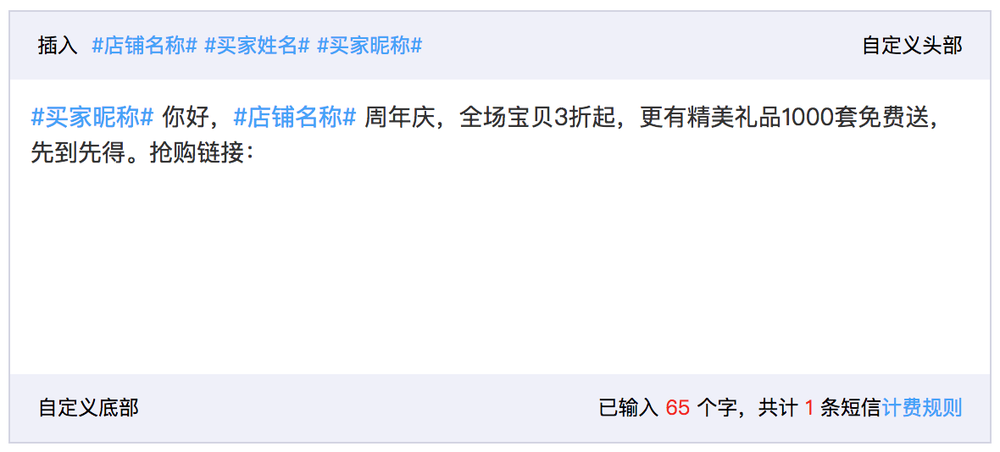

# ng-sms-editor

基于 Angular.js 的短信编辑器！



## 快速开始

```html
<ng-sms-editor sms-options="smsOptions">
    <slot-header class="custom-header">自定义头部</slot-header>
    <slot-footer class="custom-footer">自定义底部</slot-footer>
</ng-sms-editor>
```

```js
var app = angular.module('module', ['ng-sms-editor']);

app.controller("defaultCtrl", ["$scope", function($scope) {
    $scope.smsOptions = {
        content: '#买家昵称#你好，#店铺名称#周年庆，全场宝贝3折起，更有精美礼品1000套免费送，先到先得。抢购链接：',
        sign_content: '淘宝',
        showPreview: true,
        labels: [
            {
                name: '#店铺名称#',
                type: 'placeholder',
                placeholder: '无敌美店'
            },
            {
                name: '#买家姓名#',
                type: 'placeholder',
                placeholder: '张三三'
            },
            {
                name: '#买家昵称#',
                type: 'placeholder',
                placeholder: 'tb88888_2017'
            },
        ],
    };
}]);
```

## Options

### content

短信文本

- Type: `String`
- Required: true
- Default: `''`

### contentLength

短信文本长度

- Type: `Number`
- Required: false
- Default: `0`

### labels

短信变量，用于服务端动态替换短信内容

- Type: `Array/Object`
- Required: false
- Default: `[]`

```js
[
    {
        name: '#店铺名称#',
        type: 'placeholder',
        placeholder: '无敌美店',
        insertText: '#店铺名称#'
    },
    {
        name: '#买家姓名#',
        type: 'placeholder',
        placeholder: '张三三'
    },
]
```

### showPreview

显示手机预览效果

- Type: `Boolean`
- Required: false
- Default: `false`
